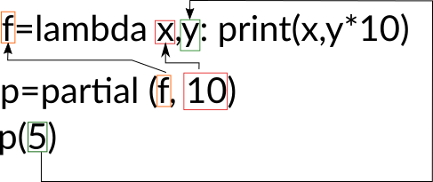

Title: Les lambda expressions en python
Date: 2021-12-25 23:00
Modified: 2021-12-26 10:00
Category: Python
Tags: lambda, common issues
Slug: les-lambda-expressions-en-python
Authors: Charles Monod-Broca
Summary: Tutoriel en python sur les lambda expressions et les problèmes courants

# Les lambda expressions en python

Ceci est le premier article de mon blog, et aujourd'hui je voulais vous partager mon expérience avec les lambda expressions en python.

## Présentation

Cette syntaxe très pratique permet de créer des objets "appelables" sans définir une fonction entière, pour peu que le code a exécuter tienne en une ligne.

Exemple, avec une fonction qui renvoie deux fois la valeur de son unique paramètre. Avec une fonction:

```python
def f(x):
    return 2*x
```

Avec une lambda expression:

```python
f = lambda x:2*x
```

Quelques différences:

- La lambda expression tient en une seule ligne (alors que définir une fonction demande toujours au minimum deux lignes)
- Dans une lambda expression, pas de mot-clé return: le résultat à droite des `:` **est** sa valeur de retour. Plus simple ;)

Pour utiliser une lambda expression, pas besoin de lui donner un nom: on peut simplement la définir, et la passer en paramètre d'une fonction sans jamais la nommer. C'est pourquoi elles sont souvent appelées fonctions anonymes dans la littérature. Cependant, pas de nom à la déclaration ne veut pas dire pas de nom tout court: il faut de toutes façons lui associer une variable ne serait-ce que pour y faire référence. Donc une fonction qui prend un appelable en paramètre, si on lui passe une lambda, elle y fera référence par le nom du paramètre concerné (voir exemple ci-dessous).

## À quoi servent-elles ?

Le cas typique, c'est quand on travaille avec des itérables (liste, tuple, dictionnaire, générateur...).

Prenons cette liste: `l = [("Alice",45), ("Bob",30), ("Charles",12)]`.
Chaque élément de cette liste est un tuple, sous la forme `(Prénom, Âge)`. 

Mais comment trier cette liste ? Si on ne précise pas, python s'en sort quand même:

```python
l = [("Charles",0), ("Bob",3), ("Alice",4)]
sorted(l)
```

Résultat:

```python
[('Alice', 4), ('Bob', 3), ('Charles', 0)]
```

Comme vous pouvez constater, la liste est triée uniquement selon le premier élément de chaque tuple.
Et en cas d'égalité (par exemple si on compare (0,10) et (0,5)), python compare le champ suivant de chaque élément à départager. Dans le cas où on veut comparer (0,10) à (0,5), cela revient à comparer 10 et 5.

Mais que viennent faire les lambdas dans tout ça ? Eh bien, si vous voulez trier selon le second élément uniquement, il suffit de passer un "appelable" à la fonction sorted. Voyez plutôt:

```python
l = [("Charles",0), ("Bob",3), ("Alice",4)]
sorted(l,key=lambda e:e[1])
```

Résultat:

```python
[('Charles', 0), ('Bob', 3), ('Alice', 4)]
```

Ici, on a passé une lambda expression à la fonction `sorted`. Cette dernière va donc utiliser cet "appelable" comme clé pour comparer les éléments de l.
L'idée est que `sorted` va appeler son paramètre `key` à chaque fois qu'elle aura besoin de comparer deux éléments. Elle appellera cette fonction avec l'élément "brut" en paramètre, en s'attendant à recevoir une valeur qui lui permettra de réellement comparer les éléments entre eux.

On aurait tout à fait pu passer par une fonction d'ailleurs. Et pour voir ce qui se passe derrière tout ça, je vous propose cette fonction un peu bavarde:

```python
def my_key(element):
    print("Fonction key appelée avec ",element)
    return element[0]

l = [("Charles",0), ("Bob",3), ("Alice",4)]
sorted(l,key=my_key)
```

Cette fonction le dit à chaque fois qu'elle est appelée, ce qui nous permet de suivre son utilisation.

Résultat:

```python
Fonction key appelée avec  ('Charles', 0)
Fonction key appelée avec  ('Bob', 3)
Fonction key appelée avec  ('Alice', 4)
Sortie: [('Alice', 4), ('Bob', 3), ('Charles', 0)]
```

Comme vous pouvez l'observer, le paramètre `key` est appelé pour chaque élément de la liste. Bien sûr, si la liste est plus longue, la fonction sera appelée à chaque fois qu'une comparaison sera nécessaire, et le nombre d'appels dépendra directement de la complexité algorithmique de la fonction de tri. Mais ce n'est pas le sujet de cet article !


## Les erreurs que vous pourriez rencontrer...

Maintenant que vous savez comment utiliser une lambda expression, vous allez probablement vouloir en mettre partout. Malheureusement, dans certains cas, vous pourriez vous retrouver avec un résultat complètement inattendu. Mieux vaut prévenir que guérir, donc. Et voici une situation typique dont j'ai pu faire les frais en participant au développement de cutevariant.

Considérez ce morceau de code en python:

```python
# Déclarer un dictionnaire vide
d = {}
for i in range(10):
    # Assigne à la clé i une lambda expression qui affiche i.
    d[i] = lambda:print(i)
```

Que fait ce code, et pourquoi ne ferait-il pas ce qu'on attend de lui ?
À première vue, d est un dictionnaire dont les clés sont des entiers (de 0 à 9), et les valeurs de simples lambda expressions. Intuitivement, on pourrait penser que `print(i)` devrait afficher la même valeur que la clé à laquelle l'expression lambda est associée. Vraiment, il n'y a aucune raison...

Essayons:
```python
>>> d[0]()
9
>>> d[1]()
9
>>> d[2]()
9
```

Ce qui s'est passé est plutôt clair, python évalue toutes les lambdas qui font référence à la variable `i` avec la dernière valeur qu'elle a prise...
Et malheureusement, ce comportement est parfaitement normal pour une simple lambda expression. En effet, en python, les lambda expressions sont incapables de capturer les variables locales au moment de leur déclaration ! Dans notre exemple, tout se passe comme si python évaluait la lambda expression une fois la déclaration terminée. 

Mais commment contourner ce problème, me demanderez-vous ?

## ... Et comment les corriger

Reprenons l'exemple plus haut.

```python
# Déclarer un dictionnaire vide
d = {}
for i in range(10):
    # Assigne à la clé i une lambda expression qui affiche i.
    d[i] = lambda:print(i)
```

En réalité, dans la plupart des cas que j'ai rencontrés, j'avais besoin de garder un registre des "appelables" existants, et de leur dire pourquoi/par qui ils ont été appelés (grâce à un numéro ou à un nom). `d` sert donc ici de registre dans la démonstration, et la lambda expression est ce fameux "appelable".
Le rôle de `d` est donc d'associer une clé à un "appelable".

Maintenant, voici une solution possible afin que chaque "appelable" recoive la valeur qui leur est associée.

```python
from functools import partial
# Déclarer un dictionnaire vide
d = {}
for i in range(10):
    # Assigne à la clé i une lambda expression qui affiche i.
    d[i] = partial(lambda i:print(i),i)
```

Un `partial`, c'est un "appelable" qui prépare un appel de fonction. Par exemple, vous voulez capturer la valeur d'une variable locale à un instant t. Mais vous voulez appeler la fonction plus tard. Premier paramètre de partial: la fonction. Chaque argument supplémentaire de partial sera passé en argument à la fonction que vous voulez appeler à la fin. Vous pouvez aussi passez des arguments nommés, dans ce cas l'ordre n'a aucune importance (tant que la fonction à appeler est le premier argument de partial).

Un dessin vaut mieux qu'un long discours:



Voilà ! Maintenant, vous savez comment utiliser les lambda expressions et éviter les pièges !
J'espère que cet article vous aura été utile, et si vous avez des questions n'hésitez pas à ouvrir une issue sur [GitHub](https://github.com/SteampunkIslande/blog/issues){target="_blank"} (C'est moins casse-pied que d'installer Disqus, peut-être plus tard).